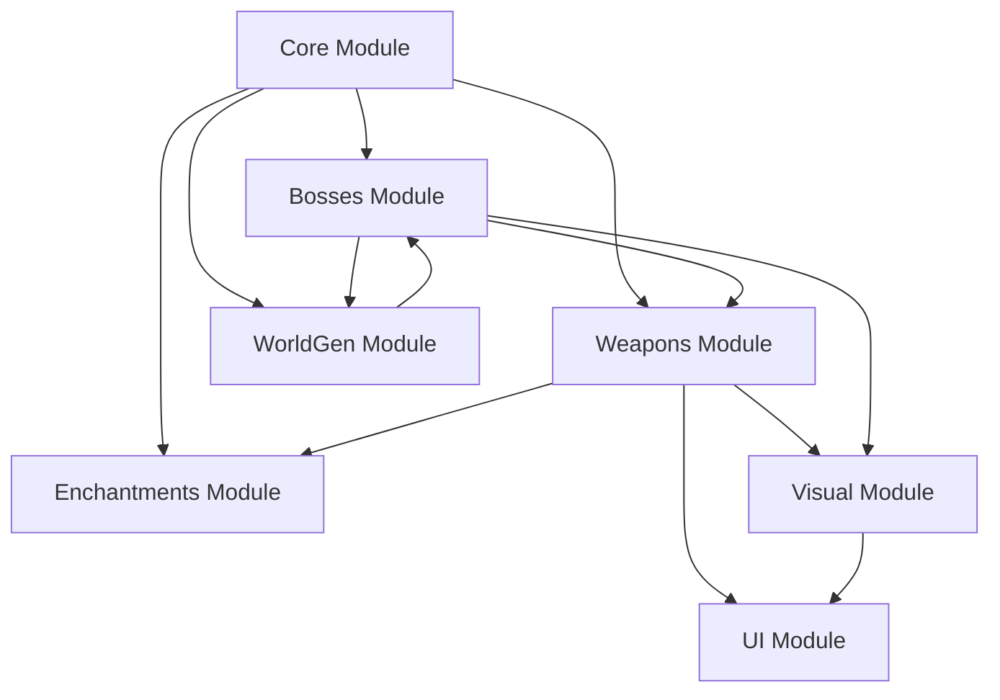

# Design Document - Mythical Swords Mod

## Overview

El Mythical Swords Mod es un mod de Minecraft 1.20.1 para Fabric que añade 36 armas míticas de 8 mitologías diferentes, 16 jefes legendarios, minerales personalizados, encantamientos especiales, y un sistema de progresión de armas. El mod está diseñado para ser modular, extensible y compatible con otros mods de Minecraft.

## Architecture

### High-Level Architecture

```
MythicalSwordsMod
├── Core System
│   ├── Mod Initializer (Fabric Entry Point)
│   ├── Registry Manager
│   └── Configuration Manager
├── Items Layer
│   ├── Mythical Weapons
│   ├── Crafting Materials
│   └── Special Items
├── Entities Layer
│   ├── Mythical Bosses
│   └── Custom Projectiles
├── World Generation Layer
│   ├── Ore Generation
│   ├── Structure Generation
│   └── Biome Modifications
├── Enchantments & Abilities Layer
│   ├── Special Enchantments
│   ├── Weapon Abilities
│   └── Elemental Affinity System
├── Progression System
│   ├── Weapon Leveling
│   └── Experience Tracking
├── Visual Effects Layer
│   ├── Particle Systems
│   ├── Weapon Auras
│   └── Sound Effects
└── UI Layer
    ├── Mythical Forge GUI
    └── Weapon Tooltips
```

### Technology Stack

- **Minecraft Version**: 1.20.1
- **Mod Loader**: Fabric
- **Required Dependencies**: Fabric API
- **Language**: Java 17
- **Build Tool**: Gradle

### Internal Module Structure

El mod está organizado en módulos internos para facilitar el desarrollo incremental y compilación más rápida:

```
src/main/java/com/mythicalswords/
├── core/                    # mythicalswords-core
│   ├── MythicalSwordsMod.java
│   ├── registry/
│   └── config/
├── weapons/                 # mythicalswords-weapons
│   ├── items/
│   ├── abilities/
│   └── leveling/
├── bosses/                  # mythicalswords-bosses
│   ├── entities/
│   ├── ai/
│   └── phases/
├── worldgen/                # mythicalswords-worldgen
│   ├── ores/
│   ├── structures/
│   └── features/
├── enchantments/            # mythicalswords-enchantments
│   ├── special/
│   └── affinity/
├── visual/                  # mythicalswords-visual
│   ├── particles/
│   ├── auras/
│   └── sounds/
└── ui/                      # mythicalswords-ui
    ├── forge/
    └── tooltips/
```

**Beneficios:**
- Compilación incremental más rápida
- Desarrollo paralelo por módulos
- Testing aislado por componente
- Fácil mantenimiento y debugging

### Module Dependencies



**Dependency Chain:**
1. **Core** → Base registries, config
2. **WorldGen** → Ores, structures (depends on Core)
3. **Enchantments** → Special enchantments (depends on Core)
4. **Weapons** → Items, abilities (depends on Core, Enchantments)
5. **Bosses** → Entities, AI (depends on Core, Weapons, WorldGen)
6. **Visual** → Particles, auras (depends on Weapons, Bosses)
7. **UI** → GUIs, tooltips (depends on Weapons, Visual)

## Components and Interfaces

### 1. Core System

#### ModInitializer
```java
public class MythicalSwordsMod implements ModInitializer {
    public static final String MOD_ID = "mythicalswords";
    public static final Logger LOGGER = LoggerFactory.getLogger(MOD_ID);
    
    @Override
    public void onInitialize() {
        // Initialize all registries
        ModItems.register();
        ModBlocks.register();
        ModEntities.register();
        ModEnchantments.register();
        ModRecipes.register();
        ModWorldGen.register();
        ModSounds.register();
    }
}
```

#### Registry Manager
- Centraliza el registro de todos los elementos del mod
- Usa el namespace "mythicalswords" consistentemente
- Implementa lazy initialization para optimizar carga

### 2. Items Layer

#### Base Weapon Class
```java
public abstract class MythicalWeaponItem extends SwordItem {
    private final WeaponTier tier;
    private final ElementalAffinity affinity;
    private final WeaponAbility ability;
    private final String mythology;
    
    // Weapon stats
    protected int baseAttackDamage;
    protected float attackSpeed;
    protected int durability;
    
    // Leveling system
    private static final String NBT_LEVEL = "WeaponLevel";
    private static final String NBT_XP = "WeaponXP";
    
    public abstract void onRightClick(World world, PlayerEntity player);
    public abstract void renderAura(MatrixStack matrices, VertexConsumerProvider provider);
}
```

#### Weapon Categories

**Craftable Weapons (20 armas)**
- Tier system: COMMON → RARE → EPIC
- Base damage: 6-10
- Durability: 1000-2000

**Boss-Drop Weapons (16 armas)**
- Tier: LEGENDARY
- Base damage: 12-18
- Durability: 3000-5000
- Unique abilities guaranteed

#### Material Items
```java
public class MythicalMaterialItem extends Item {
    private final MaterialRarity rarity;
    private final String culturalOrigin;
    
    public enum MaterialRarity {
        COMMON,      // Mythril Ingot, Sacred Iron
        UNCOMMON,    // Northsteel, Jade Imperial
        RARE,        // Soul of Swordsmith, Gem of Bishamon
        LEGENDARY    // Sacred Water of Amaterasu
    }
}
```

### 3. Entities Layer

#### Boss Entity Base Class
```java
public abstract class MythicalBossEntity extends HostileEntity implements Boss {
    private final BossBar bossBar;
    private final String mythology;
    private final ItemStack guaranteedDrop;
    
    // Boss stats
    protected float baseHealth = 600.0f; // 3x Ender Dragon
    protected float attackDamage;
    protected float movementSpeed;
    
    // Attack patterns
    protected List<AttackPattern> attackPatterns;
    protected int currentPhase = 1;
    
    public abstract void performSpecialAttack();
    public abstract void transitionPhase();
    
    @Override
    protected void dropLoot(DamageSource source, boolean causedByPlayer) {
        // 100% drop rate for mythical weapon
        this.dropStack(guaranteedDrop.copy());
    }
}
```

#### Boss Implementations

**16 Bosses organizados por mitología:**

1. **Arthurian**: Rey Arturo
2. **Greek**: Atenea
3. **Norse**: Odín, Loki
4. **Japanese**: Susanoo, Oni Oscuro, Izanagi
5. **Mesoamerican**: Quetzalcóatl
6. **Chinese**: Sun Wukong, Dragón Amarillo
7. **Hindu**: Vishnu, Shiva
8. **Egyptian**: Ra, Anubis
9. **Celtic**: Lugh, Cúchulainn

Cada boss tiene:
- 3 fases de combate
- 4-6 ataques únicos
- Spawn en estructura específica
- No respawn natural

### 4. World Generation Layer

#### Ore Generation
```java
public class ModOreGeneration {
    // Mythril Ore
    public static final ConfiguredFeature<?, ?> MYTHRIL_ORE = 
        Feature.ORE.configure(
            new OreFeatureConfig(
                OreConfiguredFeatures.STONE_ORE_REPLACEABLES,
                ModBlocks.MYTHRIL_ORE.getDefaultState(),
                6 // vein size
            )
        ).range(new RangeDecoratorConfig(
            UniformHeightProvider.create(YOffset.fixed(-64), YOffset.fixed(16))
        )).spreadHorizontally().repeat(2); // 2 veins per chunk
    
    // Similar for other ores: Sacred Iron, Jade, etc.
}
```

#### Structure Generation

**Cultural Structures:**
- Greek Temples (mármol, columnas)
- Norse Halls (piedra oscura, madera)
- Japanese Shrines (madera roja, linternas)
- Egyptian Pyramids (arenisca, jeroglíficos)
- Celtic Stone Circles (piedra musgosa)
- Chinese Temples (terracota, jade)
- Mesoamerican Pyramids (piedra tallada)
- Hindu Temples (piedra decorada)

Cada estructura contiene:
- Cofres con materiales especiales
- Spawn point para boss correspondiente
- Decoración temática

### 5. Enchantments & Abilities Layer

#### Special Enchantments

```java
public class ElementalEdgeEnchantment extends Enchantment {
    public ElementalEdgeEnchantment() {
        super(Rarity.RARE, EnchantmentTarget.WEAPON, 
              new EquipmentSlot[]{EquipmentSlot.MAINHAND});
    }
    
    @Override
    public int getMaxLevel() { return 3; }
    
    @Override
    public void onTargetDamaged(LivingEntity user, Entity target, int level) {
        // Apply elemental damage based on affinity
    }
}
```

**Enchantments implementados:**
1. **Elemental Edge** - Daño elemental bonus
2. **Divine Strike** - Críticos contra no-muertos
3. **Mythical Sharpness** - Más poderoso que Sharpness vanilla
4. **Soul Reaper** - Absorbe vida
5. **Thunder Caller** - Chance de invocar rayo

#### Weapon Abilities System

```java
public interface WeaponAbility {
    void activate(World world, PlayerEntity player, ItemStack weapon);
    int getCooldownTicks();
    float getManaCost();
    boolean canUse(PlayerEntity player);
}

public class LightningStrikeAbility implements WeaponAbility {
    @Override
    public void activate(World world, PlayerEntity player, ItemStack weapon) {
        BlockPos targetPos = player.raycast(20, 1.0f, false).getBlockPos();
        LightningEntity lightning = new LightningEntity(EntityType.LIGHTNING_BOLT, world);
        lightning.setPos(targetPos.getX(), targetPos.getY(), targetPos.getZ());
        world.spawnEntity(lightning);
        
        // Visual effects
        world.addParticle(ParticleTypes.ELECTRIC_SPARK, ...);
    }
    
    @Override
    public int getCooldownTicks() { return 200; } // 10 seconds
}
```

**Abilities por arma:**
- **Excalibur**: Divine Light Slash
- **Gungnir**: Never Miss Strike
- **Mjölnir**: Thunder Storm
- **Kusanagi**: Wind Blade
- **Gae Bulg**: Piercing Thrust
- **Trishula**: Triple Strike
- **Ruyi Jingu Bang**: Size Change & Sweep

#### Elemental Affinity System

```java
public enum ElementalAffinity {
    FIRE(DamageTypes.ON_FIRE, Biomes.SNOWY_PLAINS),
    ICE(DamageTypes.FREEZE, Biomes.NETHER_WASTES),
    LIGHTNING(DamageTypes.LIGHTNING_BOLT, Biomes.OCEAN),
    DIVINE(DamageTypes.MAGIC, EntityType.ZOMBIE, EntityType.SKELETON),
    DARK(DamageTypes.WITHER, EntityType.VILLAGER),
    NATURE(DamageTypes.THORNS, Biomes.DESERT);
    
    private final DamageType damageType;
    private final List<RegistryKey<Biome>> effectiveBiomes;
    private final List<EntityType<?>> effectiveAgainst;
    
    public float calculateBonus(LivingEntity target, Biome biome) {
        float bonus = 1.0f;
        if (effectiveBiomes.contains(biome.getKey())) bonus += 0.5f;
        if (effectiveAgainst.contains(target.getType())) bonus += 0.75f;
        return bonus;
    }
}
```

### 6. Progression System

#### Weapon Leveling

```java
public class WeaponLevelingSystem {
    private static final int MAX_LEVEL = 10;
    private static final int[] XP_REQUIREMENTS = {
        100, 250, 500, 1000, 2000, 3500, 5500, 8000, 11000, 15000
    };
    
    public static void addExperience(ItemStack weapon, int xp) {
        NbtCompound nbt = weapon.getOrCreateNbt();
        int currentXP = nbt.getInt("WeaponXP");
        int currentLevel = nbt.getInt("WeaponLevel");
        
        currentXP += xp;
        
        while (currentLevel < MAX_LEVEL && 
               currentXP >= XP_REQUIREMENTS[currentLevel]) {
            currentXP -= XP_REQUIREMENTS[currentLevel];
            currentLevel++;
            onLevelUp(weapon, currentLevel);
        }
        
        nbt.putInt("WeaponXP", currentXP);
        nbt.putInt("WeaponLevel", currentLevel);
    }
    
    private static void onLevelUp(ItemStack weapon, int newLevel) {
        // Increase damage
        // Reduce cooldowns
        // Enhance abilities
        // Visual celebration
    }
}
```

**XP Sources:**
- Kill passive mob: 5 XP
- Kill hostile mob: 15 XP
- Kill mini-boss: 100 XP
- Kill mythical boss: 500 XP
- Use ability successfully: 10 XP

**Level Benefits:**
- Level 1-3: +1 damage per level
- Level 4-6: +2 damage, -10% cooldown
- Level 7-9: +3 damage, -20% cooldown, enhanced particles
- Level 10: +5 damage, -30% cooldown, unique aura

### 7. Visual Effects Layer

#### Particle System

```java
public class WeaponAuraRenderer {
    public static void renderAura(ItemStack weapon, PlayerEntity player, 
                                   MatrixStack matrices, float tickDelta) {
        MythicalWeaponItem item = (MythicalWeaponItem) weapon.getItem();
        ElementalAffinity affinity = item.getAffinity();
        int level = weapon.getOrCreateNbt().getInt("WeaponLevel");
        
        // Base particles
        ParticleEffect baseParticle = getParticleForAffinity(affinity);
        
        // Spawn particles in orbit around weapon
        double radius = 0.3 + (level * 0.05);
        for (int i = 0; i < 3 + level; i++) {
            double angle = (player.age + tickDelta + i * 120) * 0.1;
            double x = player.getX() + Math.cos(angle) * radius;
            double y = player.getY() + 1.0 + Math.sin(angle * 2) * 0.2;
            double z = player.getZ() + Math.sin(angle) * radius;
            
            player.world.addParticle(baseParticle, x, y, z, 0, 0.02, 0);
        }
    }
    
    private static ParticleEffect getParticleForAffinity(ElementalAffinity affinity) {
        return switch(affinity) {
            case FIRE -> ParticleTypes.FLAME;
            case ICE -> ParticleTypes.SNOWFLAKE;
            case LIGHTNING -> ParticleTypes.ELECTRIC_SPARK;
            case DIVINE -> ParticleTypes.END_ROD;
            case DARK -> ParticleTypes.SMOKE;
            case NATURE -> ParticleTypes.COMPOSTER;
        };
    }
}
```

#### Sound Effects

**Custom Sounds:**
- `mythicalswords:weapon_swing_legendary`
- `mythicalswords:weapon_hit_critical`
- `mythicalswords:ability_activate`
- `mythicalswords:weapon_levelup`
- `mythicalswords:boss_spawn`
- `mythicalswords:boss_death`

### 8. UI Layer

#### Mythical Forge

```java
public class MythicalForgeScreenHandler extends ScreenHandler {
    private final Inventory inventory;
    private final PropertyDelegate propertyDelegate;
    
    // Slots
    private static final int WEAPON_SLOT = 0;
    private static final int MATERIAL_SLOT_1 = 1;
    private static final int MATERIAL_SLOT_2 = 2;
    private static final int OUTPUT_SLOT = 3;
    
    public enum ForgeOperation {
        REPAIR,           // Restore durability
        UPGRADE_ABILITY,  // Enhance weapon ability
        ADD_ENCHANTMENT,  // Apply special enchantment
        REFORGE          // Change elemental affinity
    }
}
```

**Forge GUI Features:**
- Weapon slot (center)
- 2 material slots
- Operation selector
- Progress bar
- Cost display (materials + XP)

#### Weapon Tooltips

```java
public class MythicalWeaponTooltip {
    public static void appendTooltip(ItemStack stack, List<Text> tooltip) {
        NbtCompound nbt = stack.getOrCreateNbt();
        
        // Level and XP
        int level = nbt.getInt("WeaponLevel");
        int xp = nbt.getInt("WeaponXP");
        tooltip.add(Text.literal("Level: " + level).formatted(Formatting.GOLD));
        tooltip.add(Text.literal("XP: " + xp + "/" + getRequiredXP(level))
                   .formatted(Formatting.YELLOW));
        
        // Elemental Affinity
        ElementalAffinity affinity = getAffinity(stack);
        tooltip.add(Text.literal("Affinity: " + affinity.name())
                   .formatted(getAffinityColor(affinity)));
        
        // Ability
        WeaponAbility ability = getAbility(stack);
        tooltip.add(Text.literal("Ability: " + ability.getName())
                   .formatted(Formatting.AQUA));
        tooltip.add(Text.literal("  Cooldown: " + ability.getCooldownTicks() / 20 + "s")
                   .formatted(Formatting.GRAY));
        
        // Mythology
        tooltip.add(Text.literal("Mythology: " + getMythology(stack))
                   .formatted(Formatting.LIGHT_PURPLE));
    }
}
```

## Data Models

### Weapon Data Structure

```json
{
  "id": "mythicalswords:excalibur",
  "type": "sword",
  "tier": "LEGENDARY",
  "mythology": "arthurian",
  "stats": {
    "base_damage": 15,
    "attack_speed": 1.6,
    "durability": 5000
  },
  "affinity": "DIVINE",
  "ability": {
    "type": "divine_light_slash",
    "cooldown": 300,
    "mana_cost": 50
  },
  "enchantments": [
    "mythicalswords:divine_strike",
    "mythicalswords:mythical_sharpness"
  ],
  "drop_source": {
    "type": "boss",
    "entity": "mythicalswords:boss_rey_arturo"
  }
}
```

### Boss Data Structure

```json
{
  "id": "mythicalswords:boss_rey_arturo",
  "name": "Rey Arturo",
  "mythology": "arthurian",
  "stats": {
    "health": 600,
    "armor": 20,
    "attack_damage": 12,
    "movement_speed": 0.3
  },
  "spawn": {
    "structure": "mythicalswords:arthurian_castle",
    "biomes": ["plains", "forest"]
  },
  "phases": [
    {
      "phase": 1,
      "health_threshold": 1.0,
      "attacks": ["sword_slash", "shield_bash", "charge"]
    },
    {
      "phase": 2,
      "health_threshold": 0.5,
      "attacks": ["sword_slash", "shield_bash", "charge", "summon_knights"]
    },
    {
      "phase": 3,
      "health_threshold": 0.25,
      "attacks": ["excalibur_beam", "divine_protection", "area_slash"]
    }
  ],
  "guaranteed_drop": "mythicalswords:excalibur"
}
```

### Material Obtainment Data

```json
{
  "materials": {
    "mythril_ingot": {
      "source": "smelting",
      "input": "mythicalswords:mythril_ore",
      "ore_generation": {
        "min_y": -64,
        "max_y": 16,
        "vein_size": 6,
        "veins_per_chunk": 2
      }
    },
    "shard_of_divinity": {
      "source": "structure_chest",
      "structure": "mythicalswords:greek_temple",
      "chance": 0.6
    },
    "soul_of_the_swordsmith": {
      "source": "entity_drop",
      "entity": "mythicalswords:legendary_blacksmith",
      "chance": 1.0
    }
  }
}
```

## Error Handling

### Weapon Creation Validation

```java
public class WeaponValidator {
    public static boolean validateWeaponCreation(ItemStack result, 
                                                  List<ItemStack> materials) {
        // Check all materials present
        if (!hasRequiredMaterials(materials)) {
            return false;
        }
        
        // Check player level/permissions if needed
        // Check world conditions
        
        return true;
    }
    
    public static void handleInvalidCraft(PlayerEntity player, String reason) {
        player.sendMessage(
            Text.literal("Cannot craft weapon: " + reason)
                .formatted(Formatting.RED),
            true
        );
    }
}
```

### Boss Spawn Validation

```java
public class BossSpawnValidator {
    public static boolean canSpawnBoss(ServerWorld world, BlockPos pos, 
                                        MythicalBossEntity boss) {
        // Check if boss already defeated
        if (isBossDefeated(world, boss.getType())) {
            return false;
        }
        
        // Check structure integrity
        if (!isValidStructure(world, pos)) {
            return false;
        }
        
        // Check player proximity and readiness
        List<PlayerEntity> nearbyPlayers = world.getPlayers(
            player -> player.squaredDistanceTo(Vec3d.of(pos)) < 100
        );
        
        return !nearbyPlayers.isEmpty();
    }
}
```

## Testing Strategy

### Unit Tests (Fabric Test Framework)

#### 1. Registry Tests
```java
@Test
public void testAllItemsRegistered() {
    // Verify all 36 weapons are registered
    assertNotNull(Registry.ITEM.get(new Identifier("mythicalswords", "excalibur")));
    assertNotNull(Registry.ITEM.get(new Identifier("mythicalswords", "gram")));
    // ... test all weapons
}

@Test
public void testAllBossesRegistered() {
    // Verify all 16 bosses are registered
    assertNotNull(Registry.ENTITY_TYPE.get(new Identifier("mythicalswords", "boss_rey_arturo")));
    // ... test all bosses
}
```

#### 2. Weapon Stats Calculation
```java
@Test
public void testBaseDamageCalculation() {
    ItemStack excalibur = new ItemStack(ModItems.EXCALIBUR);
    MythicalWeaponItem weapon = (MythicalWeaponItem) excalibur.getItem();
    assertEquals(15.0f, weapon.getAttackDamage());
}

@Test
public void testLevelUpBonus() {
    ItemStack weapon = new ItemStack(ModItems.GRAM);
    WeaponLevelingSystem.setLevel(weapon, 5);
    float expectedDamage = 8.0f + 5.0f; // base + level bonus
    assertEquals(expectedDamage, WeaponLevelingSystem.getTotalDamage(weapon));
}

@Test
public void testElementalAffinityMultiplier() {
    ElementalAffinity fire = ElementalAffinity.FIRE;
    Biome snowyBiome = Biomes.SNOWY_PLAINS;
    float bonus = fire.calculateBonus(null, snowyBiome);
    assertEquals(1.5f, bonus, 0.01f); // 50% bonus in cold biomes
}
```

#### 3. Crafting Recipe Validation
```java
@Test
public void testGramRecipe() {
    // Test valid recipe
    List<ItemStack> materials = Arrays.asList(
        new ItemStack(ModItems.NORTHSTEEL_INGOT, 3),
        new ItemStack(ModItems.SUN_BLESSED_ALLOY, 1),
        new ItemStack(ModItems.DRAGON_FANG_FRAGMENT, 1)
    );
    assertTrue(RecipeValidator.canCraft(ModItems.GRAM, materials));
}

@Test
public void testInvalidRecipe() {
    // Test with wrong materials
    List<ItemStack> materials = Arrays.asList(
        new ItemStack(Items.IRON_INGOT, 3)
    );
    assertFalse(RecipeValidator.canCraft(ModItems.GRAM, materials));
}
```

#### 4. XP and Leveling
```java
@Test
public void testXPGain() {
    ItemStack weapon = new ItemStack(ModItems.MASAMUNE);
    WeaponLevelingSystem.addExperience(weapon, 100);
    assertEquals(100, weapon.getOrCreateNbt().getInt("WeaponXP"));
}

@Test
public void testLevelUp() {
    ItemStack weapon = new ItemStack(ModItems.HARPE);
    WeaponLevelingSystem.addExperience(weapon, 100);
    assertEquals(1, weapon.getOrCreateNbt().getInt("WeaponLevel"));
}

@Test
public void testMaxLevelCap() {
    ItemStack weapon = new ItemStack(ModItems.EXCALIBUR);
    WeaponLevelingSystem.addExperience(weapon, 999999);
    assertEquals(10, weapon.getOrCreateNbt().getInt("WeaponLevel"));
}
```

#### 5. JSON Integrity Tests
```java
@Test
public void testAllWeaponModelsExist() {
    for (Item weapon : ModItems.getAllWeapons()) {
        Identifier id = Registry.ITEM.getId(weapon);
        String modelPath = "assets/" + id.getNamespace() + "/models/item/" + id.getPath() + ".json";
        assertTrue(resourceExists(modelPath), "Missing model: " + modelPath);
    }
}

@Test
public void testAllRecipesValid() {
    RecipeManager manager = new RecipeManager();
    // Load all recipes
    for (Recipe<?> recipe : manager.values()) {
        if (recipe.getId().getNamespace().equals("mythicalswords")) {
            assertTrue(recipe.getIngredients().size() > 0, "Empty recipe: " + recipe.getId());
        }
    }
}
```

### Integration Tests

#### 1. Boss Fights
```java
@Test
public void testBossSpawnAndDefeat() {
    ServerWorld world = createTestWorld();
    BlockPos spawnPos = new BlockPos(0, 64, 0);
    
    // Spawn boss
    MythicalBossEntity boss = ModEntities.BOSS_REY_ARTURO.create(world);
    boss.setPos(spawnPos.getX(), spawnPos.getY(), spawnPos.getZ());
    world.spawnEntity(boss);
    
    assertTrue(boss.isAlive());
    
    // Simulate defeat
    boss.damage(DamageSource.GENERIC, 9999);
    assertFalse(boss.isAlive());
    
    // Verify drop
    List<ItemEntity> drops = world.getEntitiesByClass(ItemEntity.class, 
        Box.of(Vec3d.of(spawnPos), 10, 10, 10), e -> true);
    assertTrue(drops.stream().anyMatch(e -> 
        e.getStack().getItem() == ModItems.EXCALIBUR));
}

@Test
public void testBossPhaseTransition() {
    MythicalBossEntity boss = createTestBoss();
    boss.setHealth(boss.getMaxHealth());
    assertEquals(1, boss.getCurrentPhase());
    
    boss.setHealth(boss.getMaxHealth() * 0.4f); // Below 50% threshold
    assertEquals(2, boss.getCurrentPhase());
}
```

#### 2. World Generation
```java
@Test
public void testOreGeneration() {
    ServerWorld world = createTestWorld();
    ChunkGenerator generator = world.getChunkManager().getChunkGenerator();
    
    // Generate chunks and count ore
    int mythrilCount = 0;
    for (int x = 0; x < 16; x++) {
        for (int z = 0; z < 16; z++) {
            Chunk chunk = world.getChunk(x, z);
            mythrilCount += countBlockInChunk(chunk, ModBlocks.MYTHRIL_ORE);
        }
    }
    
    assertTrue(mythrilCount > 0, "No mythril ore generated");
}

@Test
public void testStructureGeneration() {
    ServerWorld world = createTestWorld();
    
    // Search for Greek temple
    BlockPos templePos = world.locateStructure(
        ModStructures.GREEK_TEMPLE, 
        new BlockPos(0, 64, 0), 
        100, 
        false
    );
    
    assertNotNull(templePos, "Greek temple not found");
}
```

#### 3. Forge Operations
```java
@Test
public void testWeaponRepair() {
    ItemStack weapon = new ItemStack(ModItems.GRAM);
    weapon.setDamage(500);
    
    MythicalForgeBlockEntity forge = createTestForge();
    forge.setStack(0, weapon);
    forge.setStack(1, new ItemStack(ModItems.NORTHSTEEL_INGOT, 2));
    
    forge.repair();
    
    assertTrue(weapon.getDamage() < 500);
}
```

### Performance Tests

#### 1. Particle Rendering
```java
@Test
public void testParticlePerformance() {
    // Simulate 10 players with mythical weapons
    List<PlayerEntity> players = createTestPlayers(10);
    
    long startTime = System.nanoTime();
    for (int i = 0; i < 100; i++) { // 100 ticks
        for (PlayerEntity player : players) {
            WeaponAuraRenderer.renderAura(
                player.getMainHandStack(), 
                player, 
                new MatrixStack(), 
                1.0f
            );
        }
    }
    long endTime = System.nanoTime();
    
    long avgTimePerTick = (endTime - startTime) / 100;
    assertTrue(avgTimePerTick < 5_000_000, "Particle rendering too slow"); // < 5ms per tick
}
```

#### 2. Boss AI Performance
```java
@Test
public void testBossAIPerformance() {
    ServerWorld world = createTestWorld();
    List<MythicalBossEntity> bosses = new ArrayList<>();
    
    // Spawn 5 bosses
    for (int i = 0; i < 5; i++) {
        MythicalBossEntity boss = ModEntities.BOSS_ODIN.create(world);
        boss.setPos(i * 20, 64, 0);
        world.spawnEntity(boss);
        bosses.add(boss);
    }
    
    long startTime = System.nanoTime();
    for (int i = 0; i < 100; i++) {
        for (MythicalBossEntity boss : bosses) {
            boss.tick();
        }
    }
    long endTime = System.nanoTime();
    
    long avgTimePerTick = (endTime - startTime) / 100;
    assertTrue(avgTimePerTick < 10_000_000, "Boss AI too slow"); // < 10ms per tick
}
```

### Data Pack Validation Tests

```java
@Test
public void testAllLootTablesValid() {
    LootManager lootManager = new LootManager();
    
    for (MythicalBossEntity boss : ModEntities.getAllBosses()) {
        Identifier lootTableId = boss.getLootTableId();
        LootTable lootTable = lootManager.getTable(lootTableId);
        
        assertNotNull(lootTable, "Missing loot table: " + lootTableId);
        assertFalse(lootTable.isEmpty(), "Empty loot table: " + lootTableId);
    }
}

@Test
public void testAllTexturesExist() {
    for (Item weapon : ModItems.getAllWeapons()) {
        Identifier id = Registry.ITEM.getId(weapon);
        String texturePath = "assets/" + id.getNamespace() + "/textures/item/" + id.getPath() + ".png";
        assertTrue(resourceExists(texturePath), "Missing texture: " + texturePath);
    }
}
```

## Implementation Roadmap

### 📌 Phase 1: MVP (Minimum Viable Product)

**Goal:** Demostrar concepto básico funcional

**Scope:**
- 1 boss (Rey Arturo)
- 3 armas (1 crafteable: Gram, 1 boss-drop: Excalibur, 1 material: Mythril Ingot)
- 1 ore (Mythril Ore con generación)
- Sistema de XP básico (ganar XP, subir nivel, +1 daño por nivel)
- 1 habilidad simple (Divine Light Slash para Excalibur)
- Texturas básicas

**Deliverables:**
- Mod carga sin crashes
- Se puede minar Mythril, fundirlo, craftear Gram
- Se puede encontrar y derrotar a Rey Arturo
- Excalibur dropea al 100%
- Armas ganan XP al matar mobs
- Habilidad se activa con click derecho

**Testing:**
- Registry load test
- Crafting recipe validation
- Boss spawn and defeat
- XP gain verification

**Estimated Time:** 2-3 semanas

---

### 📌 Phase 2: Core Mythologies (3 mitologías)

**Goal:** Expandir a 3 mitologías completas

**Scope:**
- 3 mitologías: Artúrica, Nórdica, Griega
- 6 bosses (Rey Arturo, Odín, Loki, Atenea + 2 mini-bosses)
- 9 armas (3 por mitología)
- 3 ores adicionales (Northsteel, Sacred Iron, Jade)
- 3 estructuras (Castillo Artúrico, Salón Nórdico, Templo Griego)
- Sistema de afinidades elementales (Fire, Ice, Divine)
- 5 habilidades únicas

**Deliverables:**
- 3 mitologías jugables end-to-end
- Estructuras generan en mundo
- Bosses spawn en estructuras
- Sistema de afinidades funcional
- Materiales especiales en cofres

**Testing:**
- Structure generation validation
- Boss AI behavior tests
- Elemental affinity damage calculation
- Loot table verification

**Estimated Time:** 4-5 semanas

---

### 📌 Phase 3: Full Release (8 mitologías completas)

**Goal:** Implementación completa de todas las mitologías

**Scope:**
- 8 mitologías: Artúrica, Nórdica, Griega, Japonesa, Mesoamericana, China, Hindú, Egipcia, Celta
- 16 bosses totales
- 36 armas totales (20 crafteables, 16 boss-drops)
- Todos los minerales y materiales especiales
- Todas las estructuras culturales
- Sistema de progresión completo (10 niveles)
- Todas las habilidades y encantamientos
- Forja Mítica con GUI
- Efectos visuales completos (partículas, auras, sonidos)

**Deliverables:**
- Mod completo según requisitos
- Todas las armas implementadas
- Todos los bosses con 3 fases
- Sistema de progresión balanceado
- Efectos visuales pulidos
- Documentación completa

**Testing:**
- Comprehensive integration tests
- Performance benchmarks
- Balance testing
- Multiplayer compatibility
- Mod compatibility tests

**Estimated Time:** 8-10 semanas

---

### 📌 Phase 4: Polish & Optimization

**Goal:** Pulir experiencia y optimizar rendimiento

**Scope:**
- Balance final de stats
- Optimización de rendimiento
- Corrección de bugs
- Mejoras de UX
- Documentación de usuario
- Trailer y screenshots

**Deliverables:**
- Mod optimizado y balanceado
- Wiki completa
- Guía de usuario
- Assets promocionales

**Estimated Time:** 2-3 semanas

---

## Implementation Phases (Detailed)

### Phase 1: Core Foundation
- Mod initializer
- Registry system
- Base weapon class
- Basic materials

### Phase 2: Craftable Weapons
- Implement 20 craftable weapons
- Create textures
- Define recipes
- Add ore generation

### Phase 3: Boss System
- Base boss entity
- Implement 16 bosses
- Boss AI and attacks
- Structure generation

### Phase 4: Abilities & Enchantments
- Weapon abilities system
- Special enchantments
- Elemental affinity
- Cooldown management

### Phase 5: Progression
- Weapon leveling
- XP tracking
- Level-up bonuses

### Phase 6: Visual Polish
- Particle effects
- Weapon auras
- Sound effects
- Custom animations

### Phase 7: Mythical Forge
- Forge block
- GUI implementation
- Upgrade operations

### Phase 8: Testing & Balance
- Comprehensive testing
- Balance adjustments
- Bug fixes
- Performance optimization


## Balance and Scaling

### Weapon Tier System

| Tier | Damage Range | Durability | Attack Speed | Obtainment | Example Weapons |
|------|--------------|------------|--------------|------------|-----------------|
| **Common** | 6-7 | 1000 | 1.6 | Basic Crafting | Clarent, Caliburn, Niké Blade |
| **Rare** | 8-9 | 1500 | 1.6 | Advanced Crafting | Gram, Harpe, Macuahuitl, Masamune |
| **Epic** | 10-12 | 2000 | 1.7 | Forge Upgrade | Upgraded versions of Rare weapons |
| **Legendary (Boss)** | 14-18 | 3000-5000 | 1.8 | Boss Drop 100% | Excalibur, Gungnir, Kusanagi, Trishula |

### Comparison with Vanilla

| Weapon | Damage | Durability | Notes |
|--------|--------|------------|-------|
| **Diamond Sword** | 7 | 1561 | Vanilla baseline |
| **Netherite Sword** | 8 | 2031 | Vanilla endgame |
| **Common Mythical** | 6-7 | 1000 | Slightly weaker but has abilities |
| **Rare Mythical** | 8-9 | 1500 | Comparable to Netherite + abilities |
| **Legendary Mythical** | 14-18 | 3000-5000 | Significantly stronger, boss-gated |

**Design Philosophy:**
- Common/Rare weapons are sidegrades to vanilla with unique abilities
- Legendary weapons are clear upgrades but require defeating challenging bosses
- Abilities and leveling system provide progression beyond raw stats

### Combat Duration Targets

| Enemy Type | Expected Combat Duration | Notes |
|------------|--------------------------|-------|
| **Passive Mob** | 1-2 hits | Quick farming |
| **Hostile Mob** | 2-4 hits | Standard combat |
| **Mini-Boss** | 30-60 seconds | Legendary Blacksmith, etc. |
| **Mythical Boss** | 5-10 minutes | Epic encounter with phases |
| **Ender Dragon** | 3-5 minutes | With Legendary weapon |

### Boss Scaling

Bosses scale in three dimensions:

| Boss Tier | Health Multiplier | Damage Multiplier | Speed Multiplier | Phases |
|-----------|-------------------|-------------------|------------------|--------|
| **Tier 1** | 3x Ender Dragon (600 HP) | 1.5x | 1.0x | 2 phases |
| **Tier 2** | 4x Ender Dragon (800 HP) | 2.0x | 1.2x | 3 phases |
| **Tier 3** | 5x Ender Dragon (1000 HP) | 2.5x | 1.5x | 3 phases + enrage |

**Boss Tier Assignments:**
- **Tier 1**: Rey Arturo, Atenea, Lugh, Cúchulainn
- **Tier 2**: Odín, Susanoo, Ra, Vishnu, Dragón Amarillo
- **Tier 3**: Loki, Oni Oscuro, Izanagi, Quetzalcóatl, Sun Wukong, Shiva, Anubis

### Weapon Leveling Scaling

| Level | Total XP Required | Damage Bonus | Cooldown Reduction | Special Effect |
|-------|-------------------|--------------|-------------------|----------------|
| 1 | 0 | +0 | 0% | Base weapon |
| 2 | 100 | +1 | 0% | - |
| 3 | 350 | +2 | 0% | - |
| 4 | 850 | +3 | -10% | Enhanced particles |
| 5 | 1850 | +4 | -10% | - |
| 6 | 3850 | +5 | -15% | - |
| 7 | 7350 | +6 | -15% | Unique aura color |
| 8 | 12850 | +7 | -20% | - |
| 9 | 20850 | +8 | -20% | - |
| 10 | 35850 | +10 | -30% | Legendary aura + title |

## Boss Unlock and Spawn System

### Boss Spawn Conditions

| Boss | Mythology | Structure | Biome | Spawn Requirement | Respawn |
|------|-----------|-----------|-------|-------------------|---------|
| **Rey Arturo** | Arthurian | Arthurian Castle | Plains, Forest | Place Excalibur Gem on altar | No |
| **Atenea** | Greek | Greek Temple | Plains, Hills | Offer 3 Golden Apples to statue | No |
| **Odín** | Norse | Valhalla Hall | Taiga, Mountains | Light 4 Eternal Flames | No |
| **Loki** | Norse | Trickster's Cave | Dark Forest | Solve 3 rune puzzles | No |
| **Susanoo** | Japanese | Storm Shrine | Ocean, Beach | Activate Torii gate during storm | No |
| **Oni Oscuro** | Japanese | Cursed Temple | Dark Forest | Defeat 10 Oni minions | No |
| **Izanagi** | Japanese | Underworld Gate | Swamp | Place 7 Soul Lanterns | No |
| **Quetzalcóatl** | Mesoamerican | Sky Pyramid | Jungle | Activate 4 Sun Totems | No |
| **Sun Wukong** | Chinese | Mountain Temple | Mountains (Y>120) | Complete Monkey Trial | No |
| **Dragón Amarillo** | Chinese | Dragon Palace | River, Ocean | Offer Dragon Pearl | No |
| **Vishnu** | Hindu | Lotus Temple | Jungle, Plains | Meditate at 4 shrines | No |
| **Shiva** | Hindu | Mountain Peak | Mountains (Y>150) | Ring Sacred Bell 3 times | No |
| **Ra** | Egyptian | Sun Pyramid | Desert | Activate at noon with Sun Core | No |
| **Anubis** | Egyptian | Tomb of Kings | Desert | Open sarcophagus with 3 keys | No |
| **Lugh** | Celtic | Stone Circle | Plains, Forest | Align 5 standing stones | No |
| **Cúchulainn** | Celtic | Warrior's Barrow | Plains | Prove worth in combat trial | No |

### Boss Loot Tables

Each boss drops:
1. **Guaranteed**: Signature mythical weapon (100%)
2. **Common**: 10-20 XP levels
3. **Common**: 5-10 rare materials related to mythology
4. **Uncommon (50%)**: Boss-specific trophy item
5. **Rare (25%)**: Unique enchanted book
6. **Very Rare (10%)**: Cosmetic armor piece

**Example - Rey Arturo Loot:**
```json
{
  "guaranteed": ["mythicalswords:excalibur"],
  "common": [
    {"item": "minecraft:experience_bottle", "count": "10-20"},
    {"item": "mythicalswords:shard_of_divinity", "count": "5-10"}
  ],
  "uncommon": [
    {"item": "mythicalswords:crown_of_camelot", "chance": 0.5}
  ],
  "rare": [
    {"item": "mythicalswords:book_divine_strike_iii", "chance": 0.25}
  ],
  "very_rare": [
    {"item": "mythicalswords:arthurian_helmet", "chance": 0.1}
  ]
}
```

### Boss Arena Types

| Arena Type | Features | Bosses |
|------------|----------|--------|
| **Open Arena** | Flat circular area, pillars for cover | Rey Arturo, Atenea, Cúchulainn |
| **Vertical Arena** | Multi-level platforms, climbing required | Sun Wukong, Quetzalcóatl |
| **Enclosed Chamber** | Tight space, environmental hazards | Oni Oscuro, Anubis |
| **Dynamic Arena** | Changes during fight (lava, water, etc.) | Loki, Shiva |
| **Sky Platform** | Floating platforms, fall damage risk | Susanoo, Dragón Amarillo |

## Mod Compatibility

### Supported Mod Integrations

#### World Generation Mods
- **TerraBlender**: Mythical ores respect custom biome distributions
- **Terralith**: Structures spawn in modded biomes with appropriate tags
- **Biomes O' Plenty**: Full compatibility with biome tags
- **Oh The Biomes You'll Go**: Structures adapt to modded biomes

**Implementation:**
```java
// Use biome tags instead of hardcoded biomes
public static final TagKey<Biome> GREEK_TEMPLE_BIOMES = 
    TagKey.of(Registry.BIOME_KEY, new Identifier("mythicalswords", "greek_temple_spawns"));
```

#### Recipe/JEI Mods
- **REI (Roughly Enough Items)**: Full recipe display support
- **EMI**: Complete integration for all crafting recipes
- **JEI (Just Enough Items)**: Forge compatibility layer

**Implementation:**
```java
// REI Plugin
public class MythicalSwordsREIPlugin implements REIClientPlugin {
    @Override
    public void registerCategories(CategoryRegistry registry) {
        registry.add(new MythicalForgeCraftingCategory());
    }
}
```

#### Equipment Mods
- **Trinkets**: Mythical weapons can be equipped in trinket slots
- **Curios (Forge)**: Cross-compatibility layer
- **Better Combat**: Weapon abilities integrate with combat system

#### Dimension Mods
- **The Aether**: Bosses can spawn in Aether biomes
- **The Twilight Forest**: Structure generation respects TF dimensions
- **Ad Astra**: Space-themed bosses in space dimensions

### Conflict Resolution

**Known Conflicts:**
- **Tinkers' Construct**: Mythical weapons cannot be melted or modified
- **Tetra**: Mythical weapons are blacklisted from Tetra modifications
- **Spartan Weaponry**: Separate weapon registries, no conflicts

**Configuration Options:**
```json
{
  "compatibility": {
    "disable_ore_gen_if_present": ["create:zinc_ore", "thermal:tin_ore"],
    "allow_weapon_modifications": false,
    "integrate_with_combat_mods": true,
    "respect_difficulty_mods": true
  }
}
```

## Asset Pipeline

### Pixel Art Style Guide

#### General Guidelines
- **Resolution**: 16x16 pixels (Minecraft standard)
- **Color Depth**: 8-bit indexed color
- **Transparency**: Full alpha channel support
- **Format**: PNG with transparency
- **Naming**: lowercase_with_underscores.png

#### Style by Mythology

| Mythology | Primary Colors | Secondary Colors | Style | Line Thickness |
|-----------|----------------|------------------|-------|----------------|
| **Greek** | Gold (#FFD700), White (#FFFFFF) | Blue (#4169E1), Marble (#F5F5DC) | Clean, geometric | 1-2px |
| **Norse** | Silver (#C0C0C0), Dark Blue (#191970) | Ice Blue (#B0E0E6), Gray (#808080) | Rugged, angular | 2px |
| **Japanese** | Red (#DC143C), Black (#000000) | White (#FFFFFF), Gold (#FFD700) | Minimalist, curved | 1px |
| **Mesoamerican** | Jade Green (#00A86B), Gold (#FFD700) | Turquoise (#40E0D0), Brown (#8B4513) | Geometric, blocky | 2px |
| **Chinese** | Red (#FF0000), Gold (#FFD700) | Jade (#00A86B), Black (#000000) | Ornate, detailed | 1px |
| **Hindu** | Orange (#FF8C00), Purple (#9370DB) | Gold (#FFD700), White (#FFFFFF) | Intricate, flowing | 1-2px |
| **Egyptian** | Gold (#FFD700), Lapis (#1E90FF) | Sand (#F4A460), Black (#000000) | Hieroglyphic, angular | 2px |
| **Celtic** | Green (#228B22), Silver (#C0C0C0) | Brown (#8B4513), Stone Gray (#708090) | Knotwork, organic | 1px |
| **Arthurian** | Royal Blue (#4169E1), Gold (#FFD700) | Silver (#C0C0C0), White (#FFFFFF) | Regal, symmetrical | 1-2px |

#### Weapon Texture Template

```
Blade Section: 8-10 pixels
Handle Section: 4-6 pixels
Guard/Pommel: 2-3 pixels
Glow/Aura Layer: Optional overlay
```

#### Particle Color Schemes

| Affinity | Primary Particle | Secondary Particle | Hex Colors |
|----------|------------------|-------------------|------------|
| **Fire** | FLAME | LAVA | #FF4500, #FF8C00 |
| **Ice** | SNOWFLAKE | SPLASH | #B0E0E6, #FFFFFF |
| **Lightning** | ELECTRIC_SPARK | END_ROD | #FFFF00, #FFFFFF |
| **Divine** | END_ROD | ENCHANT | #FFD700, #FFFFFF |
| **Dark** | SMOKE | SOUL | #4B0082, #000000 |
| **Nature** | COMPOSTER | HAPPY_VILLAGER | #228B22, #90EE90 |

### Asset Export Process

1. **Creation**: Design in Aseprite/Pixaki at 16x16
2. **Palette**: Use mythology-specific palette
3. **Export**: PNG with transparency
4. **Validation**: Check in-game with F3+T reload
5. **Optimization**: Use pngcrush or similar
6. **Version Control**: Commit to assets branch

### Asset File Structure

```
resources/
├── assets/mythicalswords/
│   ├── textures/
│   │   ├── item/
│   │   │   ├── weapons/
│   │   │   │   ├── greek/
│   │   │   │   │   ├── harpe.png
│   │   │   │   │   ├── xiphos_sagrado.png
│   │   │   │   │   └── nike_blade.png
│   │   │   │   ├── norse/
│   │   │   │   ├── japanese/
│   │   │   │   └── ...
│   │   │   └── materials/
│   │   │       ├── mythril_ingot.png
│   │   │       └── ...
│   │   ├── entity/
│   │   │   ├── boss/
│   │   │   │   ├── rey_arturo.png
│   │   │   │   └── ...
│   │   └── particle/
│   │       ├── divine_spark.png
│   │       └── ...
│   ├── sounds/
│   │   ├── weapon_swing.ogg
│   │   └── ...
│   └── models/
│       ├── item/
│       └── entity/
```

## Performance Optimization

### Particle System Optimization

#### Particle Pooling
```java
public class ParticlePool {
    private static final int POOL_SIZE = 1000;
    private static final Queue<WeaponParticle> pool = new ArrayDeque<>(POOL_SIZE);
    
    public static WeaponParticle acquire() {
        WeaponParticle particle = pool.poll();
        if (particle == null) {
            particle = new WeaponParticle();
        }
        return particle;
    }
    
    public static void release(WeaponParticle particle) {
        if (pool.size() < POOL_SIZE) {
            particle.reset();
            pool.offer(particle);
        }
    }
}
```

#### Particle Culling
- Don't render particles for players >32 blocks away
- Reduce particle count based on video settings
- Skip particle updates when not visible

```java
public void spawnParticles(World world, Vec3d pos) {
    // Check distance to nearest player
    PlayerEntity nearest = world.getClosestPlayer(pos.x, pos.y, pos.z, 32, false);
    if (nearest == null) return;
    
    // Scale particle count based on settings
    int particleCount = getParticleCount(world.getGameRules());
    
    for (int i = 0; i < particleCount; i++) {
        WeaponParticle particle = ParticlePool.acquire();
        // ... spawn particle
    }
}
```

### Ability Cooldown Optimization

#### Centralized Cooldown Manager
```java
public class CooldownManager {
    private static final Map<UUID, Map<String, Long>> cooldowns = new HashMap<>();
    
    public static boolean isOnCooldown(PlayerEntity player, String abilityId) {
        Map<String, Long> playerCooldowns = cooldowns.get(player.getUuid());
        if (playerCooldowns == null) return false;
        
        Long endTime = playerCooldowns.get(abilityId);
        if (endTime == null) return false;
        
        return System.currentTimeMillis() < endTime;
    }
    
    public static void setCooldown(PlayerEntity player, String abilityId, int ticks) {
        cooldowns.computeIfAbsent(player.getUuid(), k -> new HashMap<>())
                 .put(abilityId, System.currentTimeMillis() + (ticks * 50));
    }
    
    // Cleanup inactive players
    public static void cleanup() {
        cooldowns.entrySet().removeIf(entry -> 
            entry.getValue().values().stream()
                 .allMatch(time -> System.currentTimeMillis() > time)
        );
    }
}
```

### World Generation Throttling

#### Ore Generation Optimization
```java
public class OptimizedOreGeneration {
    private static final int MAX_ORES_PER_CHUNK = 50;
    
    public void generate(ChunkRegion region, ChunkGenerator generator, Random random, 
                         BlockPos pos, DefaultBiomeFeatures config) {
        // Throttle ore generation
        int oreCount = 0;
        
        for (OreFeature ore : ModOres.getAllOres()) {
            if (oreCount >= MAX_ORES_PER_CHUNK) break;
            
            if (random.nextFloat() < ore.getSpawnChance()) {
                ore.generate(region, generator, random, pos);
                oreCount++;
            }
        }
    }
}
```

#### Structure Generation Caching
```java
public class StructureCache {
    private static final Map<ChunkPos, List<StructureStart>> cache = 
        new ConcurrentHashMap<>();
    
    public static void cacheStructure(ChunkPos pos, StructureStart structure) {
        cache.computeIfAbsent(pos, k -> new ArrayList<>()).add(structure);
    }
    
    public static List<StructureStart> getStructures(ChunkPos pos) {
        return cache.getOrDefault(pos, Collections.emptyList());
    }
    
    // Cleanup old chunks
    public static void cleanup(Set<ChunkPos> loadedChunks) {
        cache.keySet().retainAll(loadedChunks);
    }
}
```

### Boss AI Optimization

#### Tick Reduction
```java
public abstract class OptimizedBossEntity extends MythicalBossEntity {
    private int tickCounter = 0;
    private static final int AI_UPDATE_INTERVAL = 5; // Update AI every 5 ticks
    
    @Override
    public void tick() {
        super.tick();
        
        tickCounter++;
        if (tickCounter % AI_UPDATE_INTERVAL == 0) {
            updateAI();
        }
    }
    
    protected abstract void updateAI();
}
```

#### Pathfinding Optimization
```java
public class BossPathfinding {
    private static final int MAX_PATHFINDING_DISTANCE = 64;
    private static final int PATHFINDING_CACHE_TIME = 100; // 5 seconds
    
    private Path cachedPath;
    private long lastPathfindTime;
    
    public Path findPath(MobEntity entity, Entity target) {
        long currentTime = entity.world.getTime();
        
        // Use cached path if recent
        if (cachedPath != null && 
            currentTime - lastPathfindTime < PATHFINDING_CACHE_TIME) {
            return cachedPath;
        }
        
        // Limit pathfinding distance
        double distance = entity.distanceTo(target);
        if (distance > MAX_PATHFINDING_DISTANCE) {
            return null;
        }
        
        cachedPath = entity.getNavigation().findPathTo(target, 0);
        lastPathfindTime = currentTime;
        return cachedPath;
    }
}
```

### Memory Management

#### Entity Cleanup
```java
public class EntityCleanup {
    public static void cleanupDefeatedBosses(ServerWorld world) {
        // Remove boss entities that have been dead for >5 minutes
        world.iterateEntities().forEach(entity -> {
            if (entity instanceof MythicalBossEntity boss && !boss.isAlive()) {
                if (boss.getDeathTime() > 6000) { // 5 minutes
                    entity.remove(Entity.RemovalReason.DISCARDED);
                }
            }
        });
    }
}
```

#### Weapon Data Cleanup
```java
public class WeaponDataCleanup {
    public static void cleanupUnusedWeaponData() {
        // Remove leveling data for weapons that no longer exist
        WeaponLevelingSystem.getAllTrackedWeapons().removeIf(uuid -> {
            ItemStack stack = findItemStackByUUID(uuid);
            return stack == null || stack.isEmpty();
        });
    }
}
```

### Performance Targets

| System | Target | Measurement |
|--------|--------|-------------|
| **Particle Rendering** | <5ms per tick | 10 players with weapons |
| **Boss AI** | <10ms per tick | 5 active bosses |
| **Ore Generation** | <50ms per chunk | New chunk generation |
| **Structure Generation** | <100ms per structure | Large structures |
| **Ability Activation** | <1ms | Single ability use |
| **Memory Usage** | <100MB | Full mod loaded |
| **FPS Impact** | <10% | With all features active |

### Profiling Tools

- **Spark**: Server-side performance profiling
- **JProfiler**: Memory and CPU profiling
- **Minecraft Debug Profiler**: F3+L in-game
- **Custom Metrics**: Log timing for critical operations

```java
public class PerformanceMetrics {
    public static void measureOperation(String name, Runnable operation) {
        long start = System.nanoTime();
        operation.run();
        long end = System.nanoTime();
        
        long duration = (end - start) / 1_000_000; // Convert to ms
        if (duration > 10) { // Log if >10ms
            LOGGER.warn("{} took {}ms", name, duration);
        }
    }
}
```
