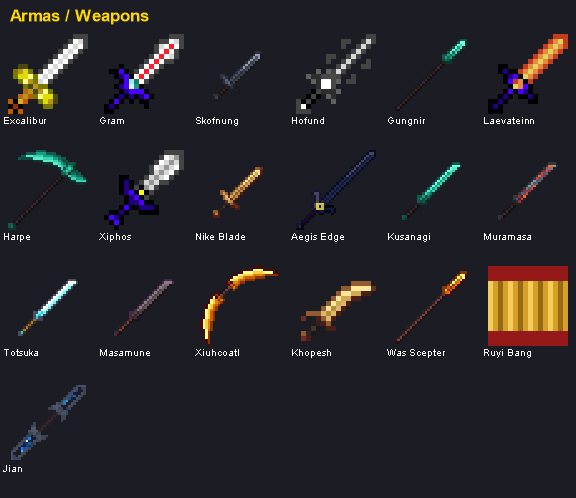
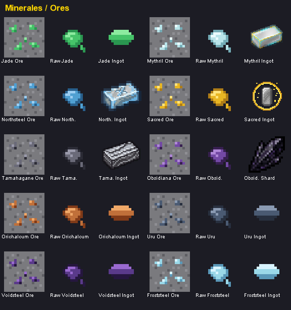
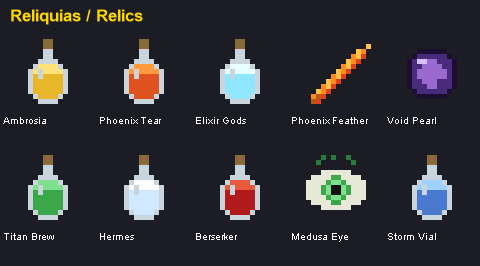

# 🗡️ Mythical Swords Mod

Un mod de Minecraft 1.20.1 para Fabric que añade armas legendarias, jefes poderosos y materiales míticos de diversas mitologías del mundo.


## 📖 Tabla de Contenidos

- [Características](#características)
- [Galería](#galería)
- [Instalación](#instalación)
- [Armas](#armas)
- [Jefes](#jefes)
- [Materiales y Minerales](#materiales-y-minerales)
- [Reliquias y Consumibles](#reliquias-y-consumibles)
- [Brújulas](#brújulas)
- [Crafteos](#crafteos)
- [Estructuras](#estructuras)
- [Sistema de Progresión](#sistema-de-progresión)
- [Créditos](#créditos)

## ✨ Características

### 🗡️ Armas Legendarias
- **18 Armas Míticas** de 7 mitologías diferentes
- **Sistema de Niveles** - Las armas ganan experiencia y se vuelven más poderosas
- **Afinidades Elementales** - Fuego, Hielo, Rayo, Divino, Oscuridad, Naturaleza
- **Habilidades Especiales** - Cada arma legendaria tiene una habilidad única activable

### 👹 Jefes Épicos
- **12 Jefes Únicos** con mecánicas de combate complejas
- **Sistema de Fases** - Los jefes cambian de estrategia según su vida
- **Drops Garantizados** - Cada jefe dropea materiales específicos
- **No Respawn** - Los jefes derrotados no reaparecen naturalmente

### 🏗️ Estructuras Personalizadas
- **Castillo Artúrico** - Hogar de Rey Arturo
- **Salón de Valhalla** - Fortaleza de Odín
- **Cueva del Embaucador** - Guarida de Loki
- **Templo Griego** - Santuario de Atenea
- **Santuarios Japoneses** - Estructuras místicas

### 💎 Materiales y Crafteo
- **10 Minerales** - Mythril, Northsteel, Sacred Iron, Tamahagane, Obsidiana Ritual, Jade Imperial, Orichalcum, Uru, Voidsteel, Froststeel
- **25+ Materiales Especiales** - Fragmentos, cristales, gemas y más
- **Recetas Complejas** - Crafteos que requieren múltiples materiales raros
- **Texturas propias** - Ores, raw y lingotes con arte pixel-art consistente

### 🧪 Reliquias y Consumibles
- **10 Reliquias** - Pociones, tótems y objetos activos con efectos potentes
- **Auto-revivir** (Pluma de Fénix), invocar rayos (Vial de Tormenta), petrificar (Ojo de Medusa), teleport (Perla del Vacío) y más
- Todas crafteables con materiales míticos

### 🧭 Brújulas Localizadoras
- **9 Brújulas** - Una por estructura; la aguja apunta físicamente a la estructura más cercana

## 🖼️ Galería

### Armas


### Minerales (Ore → Raw → Lingote)


### Reliquias y Consumibles


## 🔧 Instalación

### Requisitos
- **Minecraft:** 1.20.1
- **Fabric Loader:** 0.15.0+
- **Fabric API:** 0.91.0+1.20.1
- **Java:** 17 o superior

### Pasos de Instalación
1. Instala [Fabric Loader](https://fabricmc.net/use/)
2. Descarga [Fabric API](https://www.curseforge.com/minecraft/mc-mods/fabric-api)
3. Descarga Mythical Swords Mod
4. Coloca ambos archivos JAR en `.minecraft/mods/`
5. Inicia Minecraft con el perfil de Fabric

## 🗡️ Armas

### Armas Crafteables

#### 🏴󠁧󠁢󠁥󠁮󠁧󠁿 Mitología Artúrica
*Ninguna - Todas son drops de jefes*

#### ⚔️ Mitología Nórdica
| Arma | Tier | Daño | Afinidad | Materiales |
|------|------|------|----------|------------|
| **Gram** | RARE | 8 | Hielo | 3 Northsteel + 1 Sun-Blessed Alloy + 1 Dragon Fang |
| **Skofnung** | RARE | 9 | Hielo | 2 Northsteel + 1 Spiritbound Leather + 1 Frozen Soul Crystal |
| **Hofund** | RARE | 9 | Divino | 2 Northsteel + 2 Oro Ritual + 1 Rainbow Bridge Fragment |

#### 🏛️ Mitología Griega
| Arma | Tier | Daño | Afinidad | Materiales |
|------|------|------|----------|------------|
| **Harpe** | RARE | 8 | Divino | 2 Mythril + 1 Sacred Iron + 1 Shard of Divinity + 1 Cuero |
| **Xiphos Sagrado** | COMMON | 7 | Divino | 2 Sacred Iron + 1 Bronce Bendito + 1 Shard of Divinity |
| **Nike Blade** | COMMON | 6 | Rayo | 2 Mythril + 1 Sun-Blessed Alloy + 1 Feather of Victory |

### Armas de Jefes (Boss Drops)

#### 🏴󠁧󠁢󠁥󠁮󠁧󠁿 Mitología Artúrica
| Arma | Tier | Daño | Afinidad | Jefe | Habilidad |
|------|------|------|----------|------|-----------|
| **Excalibur** | LEGENDARY | 15 | Divino | Rey Arturo | Divine Light Slash |

#### ⚔️ Mitología Nórdica
| Arma | Tier | Daño | Afinidad | Jefe | Habilidad |
|------|------|------|----------|------|-----------|
| **Gungnir** | LEGENDARY | 16 | Rayo | Odín | Never Miss Strike |
| **Laevateinn** | LEGENDARY | 17 | Fuego | Loki | Fire Wave |

#### 🏛️ Mitología Griega
| Arma | Tier | Daño | Afinidad | Jefe | Habilidad |
|------|------|------|----------|------|-----------|
| **Aegis Edge** | LEGENDARY | 14 | Divino | Atenea | Shield Reflection |

#### ⛩️ Mitología Japonesa
| Arma | Tier | Daño | Afinidad | Jefe | Habilidad |
|------|------|------|----------|------|-----------|
| **Kusanagi-no-Tsurugi** | LEGENDARY | 16 | Naturaleza | Susanoo | Wind Blade |
| **Muramasa** | LEGENDARY | 18 | Oscuridad | Oni Oscuro | Blood Frenzy |
| **Totsuka-no-Tsurugi** | LEGENDARY | 15 | Divino | Izanagi | Soul Seal |

#### 🐍 Mitología Mesoamericana
| Arma | Tier | Daño | Afinidad | Jefe | Habilidad |
|------|------|------|----------|------|-----------|
| **Xiuhcoatl** | LEGENDARY | 17 | Fuego | Quetzalcóatl | Serpent Strike |

#### 🔆 Mitología Egipcia
| Arma | Tier | Daño | Afinidad | Jefe | Habilidad |
|------|------|------|----------|------|-----------|
| **Khopesh** | LEGENDARY | 12 | Oscuridad | Anubis | Life Steal |
| **Cetro Was** | LEGENDARY | 11 | Divino | Ra | Summon Scarabs |

#### 🐒 Mitología China
| Arma | Tier | Daño | Afinidad | Jefe | Habilidad |
|------|------|------|----------|------|-----------|
| **Ruyi Jingu Bang** | LEGENDARY | 15 | Naturaleza | Sun Wukong | Staff Slam |
| **Jian** | EPIC | 10 | Rayo | — | Swift Strikes |

## 👹 Jefes

### Lista Completa de Jefes

| Jefe | Mitología | HP | Daño | Fases | Ubicación |
|------|-----------|----|----|-------|-----------|
| **Rey Arturo** | Artúrica | 600 | 12 | 2 | Castillo Artúrico |
| **Odín** | Nórdica | 800 | 14 | 3 | Salón de Valhalla |
| **Loki** | Nórdica | 1000 | 13 | 3 + Enrage | Cueva del Embaucador |
| **Atenea** | Griega | 600 | 12 | 2 | Templo Griego |
| **Susanoo** | Japonesa | 800 | 15 | 3 | Santuario de la Tormenta |
| **Oni Oscuro** | Japonesa | 1000 | 16 | 3 + Enrage | Templo Maldito |
| **Izanagi** | Japonesa | 800 | 14 | 3 | Puerta del Inframundo |
| **Quetzalcóatl** | Mesoamericana | 1000 | 15 | 3 + Enrage | Pirámide Celestial |
| **Anubis** | Egipcia | 700 | 14 | 3 | Tumba del Desierto |
| **Ra** | Egipcia | 750 | 16 | 3 | Tumba del Desierto |
| **Sun Wukong** | China | 800 | 18 | 3 + Invencibilidad | Palacio Celestial |
| **Legendary Blacksmith** | Universal | 300 | 10 | 1 | Varios | 

### Mecánicas de Jefes

#### Sistema de Fases
- **Fase 1 (100%-50% HP):** Ataques básicos
- **Fase 2 (50%-25% HP):** Ataques mejorados + nuevas habilidades
- **Fase 3 (25%-0% HP):** Ataques definitivos + máxima agresividad
- **Enrage (algunos jefes):** Velocidad y daño aumentados drásticamente

#### Drops Garantizados
Cada jefe dropea:
- Su arma legendaria (100% de probabilidad)
- 10-20 niveles de experiencia
- 5-10 materiales especiales de su mitología

### Cómo Invocar Jefes

1. **Encuentra la estructura** correspondiente al jefe
2. **Localiza el altar** o punto de invocación
3. **Coloca los materiales** requeridos (varía por jefe)
4. **Prepárate para la batalla** - Los jefes son muy poderosos

**⚠️ Advertencia:** Los jefes derrotados NO reaparecen. Planifica bien tu estrategia.

## 💎 Materiales y Minerales

### Minerales Base

| Mineral | Nivel Y | Tamaño de Veta | Vetas/Chunk | Herramienta Requerida |
|---------|---------|----------------|-------------|----------------------|
| **Mythril Ore** | -64 a 16 | 6 bloques | 2 | Pico de Diamante |
| **Northsteel Ore** | -64 a 32 | 5 bloques | 2 | Pico de Hierro |
| **Sacred Iron Ore** | -64 a 32 | 5 bloques | 2 | Pico de Hierro |
| **Tamahagane Ore** | -64 a 32 | 5 bloques | 2 | Pico de Hierro |
| **Obsidiana Ritual Ore** | -64 a 16 | 4 bloques | 2 | Pico de Hierro |
| **Jade Imperial Ore** | -48 a 32 | 5 bloques | 2 | Pico de Hierro |
| **Orichalcum Ore** | -64 a 8 | 5 bloques | 2 | Pico de Hierro |
| **Uru Ore** | -16 a 80 | 4 bloques | 2 | Pico de Hierro |
| **Voidsteel Ore** | -64 a -8 | 4 bloques | 2 | Pico de Hierro |
| **Froststeel Ore** | 16 a 100 | 5 bloques | 2 | Pico de Hierro |

### Lingotes (Smelting)
- **Mythril Ingot** ← Raw Mythril (Horno o Blast Furnace)
- **Northsteel Ingot** ← Raw Northsteel
- **Sacred Iron Ingot** ← Raw Sacred Iron
- **Tamahagane Ingot** ← Raw Tamahagane
- **Jade Imperial Ingot** ← Raw Jade Imperial
- **Orichalcum Ingot** ← Raw Orichalcum *(Griego/Divino)*
- **Uru Ingot** ← Raw Uru *(Nórdico/Rayo)*
- **Voidsteel Ingot** ← Raw Voidsteel *(Vacío)*
- **Froststeel Ingot** ← Raw Froststeel *(Hielo)*

### Materiales Especiales

#### 🏴󠁧󠁢󠁥󠁮󠁧󠁿 Artúricos
- **Shard of Divinity** - Cofres en Templos Griegos
- **Dragon Fang Fragment** - Drop de Ender Dragon (100%), Endermen (1%)

#### ⚔️ Nórdicos
- **Northsteel Ingot** - Fundido de Northsteel Ore
- **Sun-Blessed Alloy** - Drop de Blazes (10%)
- **Spiritbound Leather** - Drop de Phantoms (8%)
- **Frozen Soul Crystal** - Drop de Strays (5%)
- **Rainbow Bridge Fragment** - Drop de Wither Skeletons (2%)

#### 🏛️ Griegos
- **Sacred Iron Ingot** - Fundido de Sacred Iron Ore
- **Shard of Divinity** - Cofres en Templos Griegos (60%)
- **Feather of Victory** - Drop de Atenea
- **Bronce Bendito** - Crafteable o drop de Atenea

#### ⛩️ Japoneses
- **Tamahagane Ingot** - Fundido de Tamahagane Ore
- **Gem of Bishamon** - Cofres en Templos Japoneses
- **Soul of the Swordsmith** - Drop de Legendary Blacksmith (100%)
- **Sacred Water of Amaterasu** - Cofres en Santuarios Shinto
- **Mango Largo Japonés** - Crafteable con palos y cuero

#### 🐍 Mesoamericanos
- **Raw Obsidiana Ritual** - Minado de Obsidiana Ritual Ore
- **Filo de Pluma de Quetzal** - Cofres en Templos de la Jungla
- **Palo Ritual** - Cofres en Templos de la Jungla

## 🧪 Reliquias y Consumibles

| Reliquia | Tipo | Efecto | Receta |
|----------|------|--------|--------|
| **Ambrosía** | Consumible | Regen II + Absorción + cura | 8 Oro + Sun-Blessed Alloy |
| **Lágrima de Fénix** | Consumible | Cura grande + Resist. Fuego + Absorción II | Blaze Powder + Agnis Flame Core |
| **Elixir de los Dioses** | Consumible | Fuerza/Resistencia/Regen/Velocidad II (30s) | Moonstone + Essence of Righteousness + Glowstone |
| **Pluma de Fénix** | Reliquia | **Auto-revive** una vez (cancela la muerte) | Lágrima de Fénix + Plumas + Blaze |
| **Perla del Vacío** | Activo | Teleport 16 bloques sin daño de caída | Ender Pearl + Obsidiana Ritual + Obsidiana |
| **Brebaje del Titán** | Consumible | Vida+ II, Resistencia II, Fuerza (60s) | Sun-Blessed Alloy + Moonstone + 2 Oro |
| **Brebaje de Hermes** | Consumible | Velocidad III, Salto II, caída lenta (15s) | 2 Plumas + 2 Azúcar + Moonstone |
| **Brebaje Berserker** | Consumible | Fuerza III, Prisa II, Velocidad II (20s) | Agnis Flame Core + Blaze + Redstone + Pólvora |
| **Ojo de Medusa** | Activo | **Petrifica** mobs en 8 bloques (8s) | 8 Obsidiana Ritual + Ojo de Ender |
| **Vial de Tormenta** | Activo | **Invoca un rayo** donde miras (40 bloques) | Pararrayos + Botella + Cobre + Moonstone |

## 🧭 Brújulas

Cada estructura tiene su brújula localizadora; la aguja apunta físicamente a la estructura más cercana al jugador (clic derecho muestra distancia y dirección).

| Brújula | Estructura | Material |
|---------|-----------|----------|
| **Camelot** | Castillo Artúrico | Mythril + Sacred Iron |
| **Valhalla** | Salón de Valhalla | — |
| **Trickster** | Cueva del Embaucador | — |
| **Griega** | Templo Griego | Shard of Divinity |
| **Bambú** | Templo de Bambú | Jade Imperial |
| **Oni** | Fortaleza Oni | Tamahagane |
| **Azteca** | Pirámide Azteca | Obsidiana Ritual |
| **Desierto** | Tumba del Desierto | Sun-Blessed Alloy |
| **Celestial** | Palacio Celestial | Moonstone |

## 🔨 Crafteos

### Armas Crafteables

#### Gram (Nórdica - RARE)
```
    N
  N A N
    D

N = Northsteel Ingot
A = Sun-Blessed Alloy
D = Dragon Fang Fragment
```

#### Skofnung (Nórdica - RARE)
```
    N
  N L C

N = Northsteel Ingot
L = Spiritbound Leather
C = Frozen Soul Crystal
```

#### Hofund (Nórdica - RARE)
```
    N
  N O R

N = Northsteel Ingot
O = Oro Ritual (Gold Ingot)
R = Rainbow Bridge Fragment
```

#### Harpe (Griega - RARE)
```
    M
    M I
  L D

M = Mythril Ingot
I = Sacred Iron Ingot
L = Leather
D = Shard of Divinity
```

#### Xiphos Sagrado (Griega - COMMON)
```
    I
  I B D

I = Sacred Iron Ingot
B = Bronce Bendito
D = Shard of Divinity
```

#### Nike Blade (Griega - COMMON)
```
    M
  M A F

M = Mythril Ingot
A = Sun-Blessed Alloy
F = Feather of Victory
```

### Items Especiales

#### Camelot Compass
```
  M M M
  M C M
    I

M = Mythril Ingot
C = Compass
I = Sacred Iron Ingot
```
*Usado para localizar Castillos Artúricos*

### Fundición (Smelting)

| Material Crudo | → | Lingote | Tiempo | XP |
|----------------|---|---------|--------|-----|
| Raw Mythril | → | Mythril Ingot | 10s | 0.7 |
| Raw Northsteel | → | Northsteel Ingot | 10s | 0.7 |
| Raw Sacred Iron | → | Sacred Iron Ingot | 10s | 0.7 |
| Raw Tamahagane | → | Tamahagane Ingot | 10s | 0.7 |
| Mythril Ore | → | Mythril Ingot | 10s | 0.7 |
| Northsteel Ore | → | Northsteel Ingot | 10s | 0.7 |
| Sacred Iron Ore | → | Sacred Iron Ingot | 10s | 0.7 |
| Tamahagane Ore | → | Tamahagane Ingot | 10s | 0.7 |

**Nota:** También se puede usar Blast Furnace para fundir más rápido (5s)

## 🏰 Estructuras

### Castillo Artúrico
- **Rareza:** 1 cada 100 chunks (~1600 bloques)
- **Biomas:** Plains, Forest
- **Distancia del Spawn:** Mínimo 240 bloques
- **Contiene:**
  - Sala del Trono con Boss Altar
  - 3-5 Cofres con loot
  - Decoración medieval
  - Punto de spawn de Rey Arturo

### Salón de Valhalla
- **Rareza:** Raro
- **Biomas:** Taiga, Snowy Plains, Mountains
- **Contiene:**
  - 4 Eternal Flame spawn points
  - Altar de invocación de Odín
  - Cofres con materiales nórdicos
  - Arquitectura vikinga

### Cueva del Embaucador
- **Rareza:** Raro
- **Biomas:** Dark Forest
- **Contiene:**
  - 3 puzzles de runas
  - Altar de invocación de Loki
  - Trampas y engaños
  - Cofres ocultos

### Templo Griego
- **Rareza:** Raro
- **Biomas:** Plains, Hills
- **Contiene:**
  - Columnas de mármol
  - Estatua de Atenea (punto de invocación)
  - Cofres con Shard of Divinity (60% chance)
  - Arquitectura clásica griega

### Santuarios Japoneses
- **Storm Shrine** - Ocean/Beach biomes
- **Cursed Temple** - Dark Forest
- **Underworld Gate** - Swamp biomes
- Contienen materiales japoneses y puntos de invocación de jefes

## 📈 Sistema de Progresión

### Niveles de Armas

Las armas míticas ganan experiencia y suben de nivel con el uso:

#### Fuentes de XP
- **Matar mob pasivo:** 5 XP
- **Matar mob hostil:** 15 XP
- **Matar mini-jefe:** 100 XP
- **Matar jefe mítico:** 500 XP
- **Usar habilidad exitosamente:** 10 XP

#### Requisitos de XP por Nivel
| Nivel | XP Requerido | XP Total Acumulado |
|-------|--------------|-------------------|
| 1 | 100 | 100 |
| 2 | 250 | 350 |
| 3 | 500 | 850 |
| 4 | 1,000 | 1,850 |
| 5 | 2,000 | 3,850 |
| 6 | 3,500 | 7,350 |
| 7 | 5,500 | 12,850 |
| 8 | 8,000 | 20,850 |
| 9 | 11,000 | 31,850 |
| 10 (MAX) | 15,000 | 46,850 |

#### Beneficios por Nivel
- **Niveles 1-3:** +1 daño por nivel
- **Niveles 4-6:** +2 daño, -10% cooldown de habilidades
- **Niveles 7-9:** +3 daño, -20% cooldown, partículas mejoradas
- **Nivel 10:** +5 daño, -30% cooldown, aura única, título legendario

### Afinidades Elementales

Cada arma tiene una afinidad elemental que otorga bonificaciones:

#### 🔥 Fuego
- **Bonus en:** Biomas fríos (Snowy Plains, Ice Spikes) +50%
- **Efectivo contra:** Mobs de hielo
- **Armas:** Laevateinn, Xiuhcoatl

#### ❄️ Hielo
- **Bonus en:** Biomas calientes (Nether, Desert) +50%
- **Efectivo contra:** Blazes, Magma Cubes
- **Armas:** Gram, Skofnung

#### ⚡ Rayo
- **Bonus en:** Océanos y durante tormentas +50%
- **Efectivo contra:** Mobs acuáticos
- **Armas:** Gungnir, Nike Blade

#### ✨ Divino
- **Bonus contra:** No-muertos (Zombies, Skeletons) +75%
- **Efectivo contra:** Wither, Wither Skeletons
- **Armas:** Excalibur, Aegis Edge, Hofund, Harpe, Xiphos Sagrado, Totsuka

#### 🌑 Oscuridad
- **Bonus contra:** Villagers y mobs pacíficos +75%
- **Efectivo en:** Nether
- **Armas:** Muramasa

#### 🌿 Naturaleza
- **Bonus en:** Desiertos y biomas áridos +50%
- **Efectivo contra:** Mobs artificiales (Golems)
- **Armas:** Kusanagi

### Habilidades Especiales

Todas las armas legendarias tienen habilidades activables con **Click Derecho**:

| Arma | Habilidad | Cooldown | Efecto |
|------|-----------|----------|--------|
| **Excalibur** | Divine Light Slash | 15s | AOE de luz divina, daño masivo |
| **Gungnir** | Never Miss Strike | 20s | Proyectil teledirigido de rayo |
| **Laevateinn** | Fire Wave | 17.5s | Onda de fuego en cono |
| **Aegis Edge** | Shield Reflection | 25s | Refleja daño recibido |
| **Kusanagi** | Wind Blade | 12.5s | Corte de viento a distancia |
| **Muramasa** | Blood Frenzy | 20s | Aumenta daño, drena vida |
| **Totsuka** | Soul Seal | 30s | Sella mobs temporalmente |
| **Xiuhcoatl** | Serpent Strike | 15s | Proyectil de serpiente de fuego |

**Nota:** Los cooldowns se reducen al subir de nivel el arma.

## 🎮 Guía de Inicio Rápido

### Primeros Pasos

1. **Mina Minerales Míticos**
   - Busca Mythril Ore (Y: -64 a 16)
   - Busca Northsteel Ore en biomas fríos
   - Busca Sacred Iron Ore en cualquier lugar

2. **Funde los Minerales**
   - Crea lingotes en un horno o blast furnace
   - Guarda los lingotes para craftear

3. **Recolecta Materiales Especiales**
   - Mata Blazes para Sun-Blessed Alloy
   - Mata Phantoms para Spiritbound Leather
   - Mata Ender Dragon para Dragon Fang Fragment

4. **Craftea tu Primera Arma**
   - Recomendado: **Gram** (más fácil de craftear)
   - Requiere: 3 Northsteel + 1 Sun-Blessed Alloy + 1 Dragon Fang

5. **Sube de Nivel tu Arma**
   - Mata mobs para ganar XP
   - Observa el tooltip para ver progreso
   - Desbloquea mejoras al subir de nivel

6. **Encuentra Estructuras**
   - Usa Camelot Compass para localizar castillos
   - Explora biomas específicos para otras estructuras
   - Prepárate antes de enfrentar jefes

7. **Derrota Jefes**
   - Equípate con armadura de diamante/netherite
   - Lleva pociones de curación
   - Aprende los patrones de ataque
   - Obtén armas legendarias como recompensa

## 🎯 Estrategias de Combate

### Consejos Generales
- **Estudia las fases:** Cada jefe cambia de estrategia al perder vida
- **Usa el entorno:** Algunas estructuras tienen ventajas tácticas
- **Gestiona cooldowns:** No desperdicies habilidades especiales
- **Aprovecha afinidades:** Usa el arma correcta contra cada enemigo

### Estrategias por Jefe

#### Rey Arturo (600 HP)
- **Fase 1:** Ataques de espada básicos
- **Fase 2:** Añade Shield Bash y Charge
- **Estrategia:** Mantén distancia, esquiva el charge, ataca después de sus combos

#### Odín (800 HP)
- **Fase 1:** Lanzazos con Gungnir
- **Fase 2:** Invoca cuervos
- **Fase 3:** Wisdom Blast (AOE)
- **Estrategia:** Elimina los cuervos rápido, esquiva el blast

#### Loki (1000 HP)
- **Fase 1:** Ataques básicos
- **Fase 2:** Crea clones ilusorios
- **Fase 3:** Magia de fuego
- **Enrage:** Velocidad aumentada
- **Estrategia:** Identifica el Loki real, usa AOE contra clones

#### Atenea (600 HP)
- **Fase 1:** Lanza y escudo
- **Fase 2:** Wisdom Beam
- **Estrategia:** Ataca por los lados, evita el beam frontal

#### Susanoo (800 HP)
- **Fase 1-3:** Ataques de tormenta progresivamente más fuertes
- **Estrategia:** Usa armas con afinidad de rayo, mantente móvil

#### Oni Oscuro (1000 HP)
- **Fase 1-3:** Ataques demoníacos
- **Enrage:** Fuerza y velocidad extremas
- **Estrategia:** Usa armas divinas, mantén distancia en enrage

#### Izanagi (800 HP)
- **Fase 1-3:** Ataques de creación/destrucción
- **Estrategia:** Equilibra agresión y defensa, usa pociones

#### Quetzalcóatl (1000 HP)
- **Fase 1-3:** Ataques de serpiente emplumada
- **Enrage:** Vuelo y ataques aéreos
- **Estrategia:** Usa arco cuando vuele, espada cuando aterrice

## 🐛 Problemas Conocidos

- Las estructuras pueden ser raras de encontrar (es intencional para balance)
- Algunos jefes pueden atravesar bloques en ciertas situaciones
- 10 de 12 jefes aún usan modelo humanoide; Anubis y Susanoo ya son 3D GeckoLib
- Traducciones incompletas en algunos idiomas

## 📝 Changelog

### v0.4.0-alpha (Actual)
- ✅ Añadida mitología Egipcia y China
- ✅ Nuevos jefes: Ra, Anubis, Sun Wukong (12 jefes totales)
- ✅ Nuevas armas: Khopesh, Cetro Was, Ruyi Jingu Bang, Jian (18 armas, 7 mitologías)
- ✅ Nuevas estructuras: Tumba del Desierto, Palacio Celestial
- ✅ **Texturas propias** para las 18 armas, 6 ores, raw y lingotes (reemplazan placeholders)
- ✅ **Ruyi Jingu Bang** convertido a modelo 3D (bastón)
- ✅ **Jefes 3D GeckoLib**: Anubis y Susanoo remodelados y animados (idle)
- ✅ **10 Reliquias/Consumibles** nuevas con efectos (auto-revive, rayos, petrificar, teleport, brebajes)
- ✅ **9 Brújulas** localizadoras (una por estructura); aguja apunta a la más cercana al jugador
- ✅ Camelot simplificado (antes era demasiado grande y fallaba al generar)
- ✅ Efectos de armas arreglados: Life Steal, Swift Strikes, Serpent Strike, velocidad de ataque por arma
- ✅ Advancements corregidos (items/entidades inexistentes)
- ✅ **4 minerales nuevos**: Orichalcum (divino), Uru (rayo), Voidsteel (vacío), Froststeel (hielo) — con ore, raw, lingote, generación y fundición

### v0.3.0-alpha
- ✅ Añadida mitología Mesoamericana
- ✅ Nuevo jefe: Quetzalcóatl
- ✅ Nueva arma: Xiuhcoatl
- ✅ Nuevo mineral: Obsidiana Ritual
- ✅ Nuevos materiales: Filo de Pluma de Quetzal, Palo Ritual
- ✅ Sistema de niveles de armas implementado
- ✅ Sistema de afinidades elementales completo
- ✅ 9 jefes totales
- ✅ 14 armas legendarias

### v0.2.0-alpha
- ✅ Añadida mitología Japonesa
- ✅ 3 nuevos jefes: Susanoo, Oni Oscuro, Izanagi
- ✅ 3 nuevas armas legendarias
- ✅ Nuevo mineral: Tamahagane
- ✅ Santuarios japoneses

### v0.1.0-alpha
- ✅ Lanzamiento inicial
- ✅ Mitologías: Artúrica, Nórdica, Griega
- ✅ 5 jefes iniciales
- ✅ 8 armas crafteables y legendarias
- ✅ 3 minerales base
- ✅ Sistema de estructuras

## 🔮 Próximas Características

### Planeado para v0.5.0
- [ ] Mitología Hindú (Vishnu, Shiva)
- [ ] Mitología Celta (Lugh, Cúchulainn)
- [ ] Forja Mítica (mejora de armas)
- [ ] Encantamientos especiales
- [ ] Más estructuras
- [ ] Texturas finales (reemplazar placeholders)

### Planeado para v1.0.0
- [ ] Sistema de misiones
- [ ] Comerciante de armas míticas
- [ ] Modo de dificultad extrema
- [ ] Texturas finales profesionales
- [ ] Traducciones completas
- [ ] Compatibilidad con mods populares

## 🤝 Créditos

### Desarrollo
- **Desarrollador Principal:** Mejia
- **Investigación Mitológica:** Fuentes diversas de mitología mundial
- **Diseño de Mecánicas:** Inspirado en RPGs clásicos

### Herramientas y Recursos
- **Texturas:** Generadas con IA (Gemini) - Placeholders temporales
- **Mod Loader:** [Fabric Team](https://fabricmc.net/)
- **Fabric API:** [Fabric API Team](https://github.com/FabricMC/fabric)
- **IDE:** Visual Studio Code + Kiro AI
- **Build Tool:** Gradle

### Agradecimientos Especiales
- Comunidad de Fabric por la documentación
- Comunidad de Minecraft Modding
- Testers alpha que reportaron bugs

## 📄 Licencia

Este mod está actualmente en fase alpha. Todos los derechos reservados.

**Permisos:**
- ✅ Uso personal
- ✅ Streaming y videos
- ✅ Inclusión en modpacks (con crédito)
- ❌ Redistribución sin permiso
- ❌ Uso comercial sin autorización

## 🔗 Enlaces

- **Issues:** [Reportar bugs](https://github.com/yourusername/mythical-swords/issues)
- **Discord:** Únete a nuestra comunidad (próximamente)
- **CurseForge:** [Descargar](https://www.curseforge.com) (próximamente)
- **Modrinth:** [Descargar](https://modrinth.com) (próximamente)

## 💝 Apoya el Proyecto

Si disfrutas este mod, puedes apoyar de las siguientes formas:

- ⭐ Dale estrella al repositorio
- 🐛 Reporta bugs y problemas
- 💡 Sugiere nuevas características
- 📢 Comparte con amigos
- 🎥 Crea contenido (videos, streams)
- 💬 Únete a la comunidad

## 📞 Contacto

- **GitHub:** [Tu perfil](https://github.com/yourusername)
- **Email:** tu-email@ejemplo.com
- **Discord:** Tu#1234

---

**Hecho con ⚔️ y ❤️ por Mejia | Powered by Fabric**

*"Que las espadas legendarias guíen tu camino..."*
